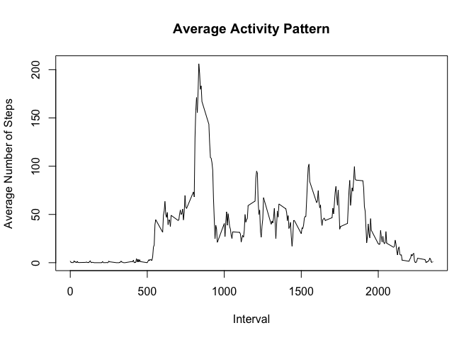
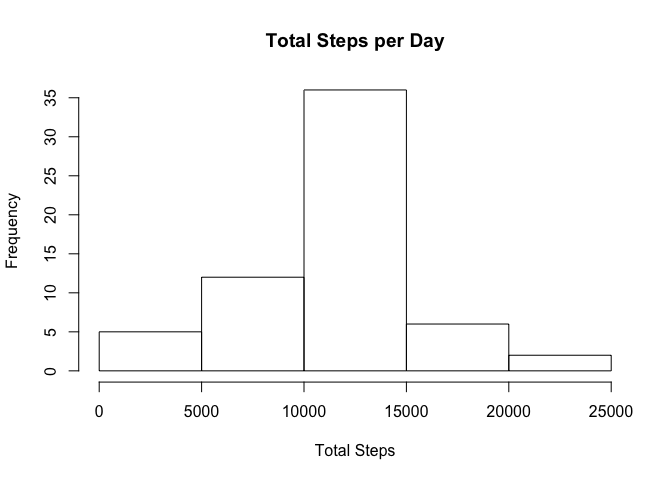

# Reproducible Research: Peer Assessment 1

## Pre-code

```r
#Libraries
suppressMessages(library(dplyr))

#Set WD
#setwd("/Users/avlaplicativos/Google Drive/Coursera/Data Science/Reproducible Research/Week2/RepData_PeerAssessment1")

#Download Data
#download.file(url = 'https://d396qusza40orc.cloudfront.net/repdata%2Fdata%2Factivity.zip', destfile = 'Data.zip', method = 'curl')

#Unzip file
#unzip(zipfile = 'Data.zip')

#Load Data into R
suppressMessages(data <- read.csv('activity.csv'))
```

## Total Steps Study

Below you can see a histogram of the total steps taken in a day


```r
#First Part: mean total number of steps per day

#Total Steps per day
StepsPerDay <- data %>% filter(!is.na(steps)) %>% group_by(date) %>% summarise(total = sum(steps)) %>% ungroup

hist(StepsPerDay$total, xlab = 'Total Steps', main = 'Total Steps per Day')
```

<!-- -->

```r
MeanMedian <- data_frame(Mean = round(mean(StepsPerDay$total), digits = 2), Median = round(median(StepsPerDay$total), digits = 2))
```

The mean steps per day is 10766.19 and the median is 10765

## Average Activity Pattern


```r
ActivityPattern <- data %>% filter(!is.na(steps)) %>% group_by(interval) %>% summarise(mean = mean(steps))

intervalMaxStep <- ActivityPattern[which(ActivityPattern$mean == max(ActivityPattern$mean)),]

with(ActivityPattern, plot(interval, mean, main = 'Average Activity Pattern', xlab = 'Interval', ylab = 'Average Number of Steps', type = 'l'))
```

<!-- -->

From the plot above, we can see that the interval with most activity on average is the 835 with 206.17 steps on average.

## Imputing missing values


```r
# Number of NAs
numberOfNAs <- sum(is.na(data$steps))
```

We have 2304 missing values in our data. We are going to fill those values with the mean number of steps for the corresponding interval and check the influence of those values in our analysis.


```r
# Filling NAs values with the mena for the interval
suppressMessages(dataFilled <- data %>% inner_join(ActivityPattern) %>% mutate(steps = ifelse(is.na(steps), round(mean, digits = 0), steps)) %>% select(-mean))

StepsPerDay2 <- dataFilled %>% filter(!is.na(steps)) %>% group_by(date) %>% summarise(total = sum(steps)) %>% ungroup

hist(StepsPerDay2$total, xlab = 'Total Steps', main = 'Total Steps per Day')
```

<!-- -->

```r
MeanMedian2 <- data_frame(Mean = round(mean(StepsPerDay2$total), digits = 2), Median = round(median(StepsPerDay2$total), digits = 2))
```

The mean steps per day is 10765.64 and the median is 10762.

It seems we augmented the frequency of the central frequency bar in our histogram and diminished the mean from 10766.19 to 10765.64 (0.0051086% of reduction) and the median from 10765 to 10762 (0.0278681% of reduction).

## Weekend Influence


```r
# Generate factor array

dataFilled <- dataFilled %>% mutate(typeOfDay = factor(ifelse(weekdays(as.Date(date)) %in% c('Domingo', 'Sábado'), 'weekend', 'weekday'))) %>% group_by(typeOfDay, interval) %>% summarise(mean = mean(steps)) %>% ungroup

par(mfrow = c(2,1), mar = c(4, 4, 1, 1))
with(dataFilled %>% filter(typeOfDay == 'weekday'), plot(interval, mean, main = 'Weekday Activity Pattern', xlab = 'Interval', ylab = 'Avg. Number of Steps', type = 'l'))
with(dataFilled %>% filter(typeOfDay == 'weekend'), plot(interval, mean, main = 'Weekend Activity Pattern', xlab = 'Interval', ylab = 'Avg. Number of Steps', type = 'l'))
```

<!-- -->

